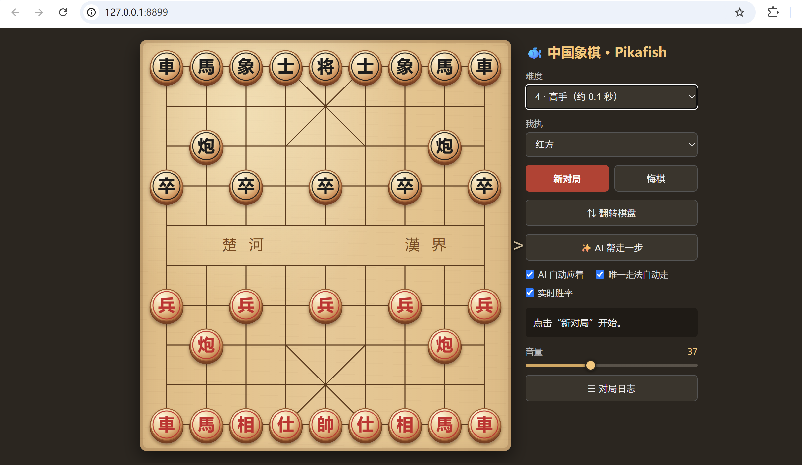

# 中国象棋 · Pikafish

一个开箱即用的 Windows 本地中国象棋网页应用。界面运行在浏览器中，棋力由随项目附带的 Pikafish 引擎提供；无需联网，也不需要安装第三方 Python 包。



## 主要功能

- 7 档难度：从带随机失误的新手档到充分搜索的最强档。
- 自由控制 AI：可自动应着、临时让 AI 帮走一步，也可完全手动走双方。
- 实时胜率：显示红胜、和棋、黑胜估计以及搜索深度、节点数和用时。
- 直观棋盘：立体棋子、落子动画、上一步标记、翻转棋盘和兵炮位花纹。
- 对局辅助：悔棋、唯一走法自动走、音量调节及自动滚动的对局日志。
- 完全本地：Python 标准库提供网页服务，Pikafish 在本机完成计算。

## 快速开始

### 环境要求

- Windows 10 或 Windows 11
- Python 3，并已将 `python` 命令加入系统 `PATH`

### 启动

1. 下载并解压整个仓库，确保 `pikafish.exe` 与 `pikafish.nnue` 位于 `Pikafish/`。
2. 双击 `启动象棋.bat`。
3. 浏览器会打开 [http://127.0.0.1:8899](http://127.0.0.1:8899)。
4. 关闭启动时出现的命令行窗口即可停止程序。

也可以在项目根目录运行：

```powershell
python server.py
```

## 基本操作

- 选择难度与执红/执黑后，点击“新对局”。
- 点击棋子，再点击目标交叉点完成落子；也支持拖动棋子。
- “AI 自动应着”关闭时可以手动操作双方；需要临时代走时点击“AI 帮走一步”。
- “实时胜率”只分析当前局面，不会替任何一方落子。
- 执黑开局时，若开启自动应着，AI 会先替红方走第一步。

## 关于胜率评估

红胜、和棋、黑胜来自 Pikafish 在当前搜索预算下的 WDL 模型，是局面估计而非理论结论。难度越高，计算通常越稳定，但用时和 CPU 占用也会增加。“红方期望得分”按 `红胜 + 0.5 × 和棋` 计算，不等同于红方直接获胜概率。

## 项目结构

```text
server.py         本地 HTTP 服务与 Pikafish 通信
web/index.html    棋盘界面、样式和交互逻辑
web/audio/        落子、吃子、将军与胜负音效
tests/            Python unittest 测试
Pikafish/         引擎程序、NNUE 权重及上游许可文档
启动象棋.bat      Windows 启动脚本
使用说明.txt      中文离线使用说明
```

## 测试

```powershell
python -m py_compile server.py
python -m unittest discover -s tests -v
```

## 许可

本项目原创代码及相关项目文件采用 [MIT License](LICENSE)。`Pikafish/` 目录不适用根目录 MIT 许可，其中：

- `pikafish.exe` 采用 GNU GPLv3，完整许可与作者信息保留在 `Pikafish/`。
- `pikafish.nnue` 采用独立的 [NNUE 许可](Pikafish/NNUE-License.md)，包含未经许可不得商用等条款。

详细说明见 [THIRD_PARTY_NOTICES.md](THIRD_PARTY_NOTICES.md)。Pikafish 上游项目：[official-pikafish/Pikafish](https://github.com/official-pikafish/Pikafish)。更新引擎时请同时替换相互兼容的 `pikafish.exe` 与 `pikafish.nnue`。
